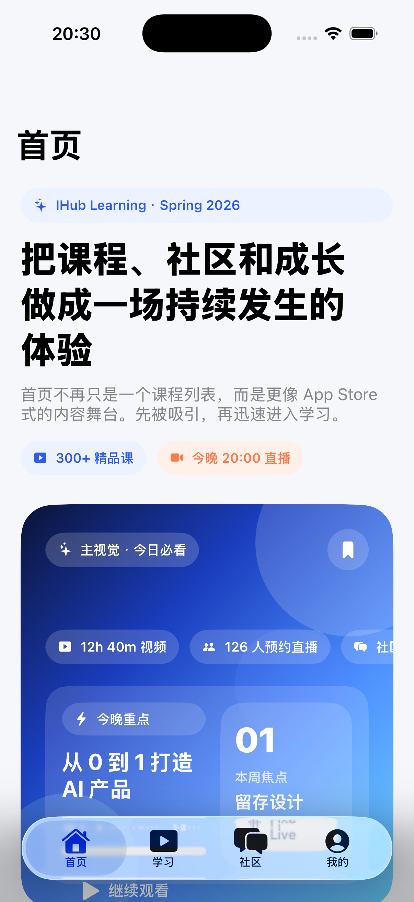
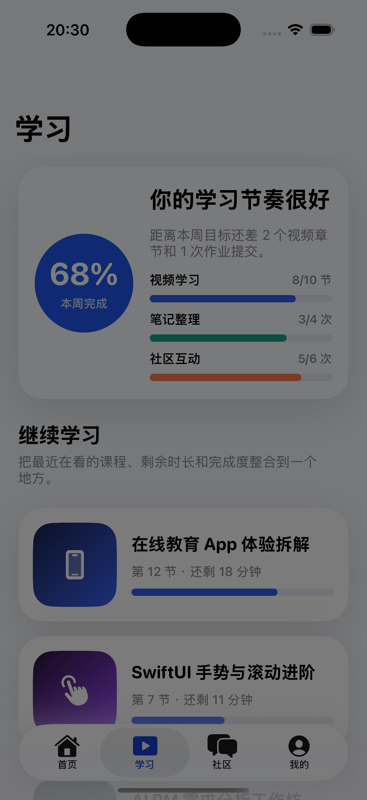
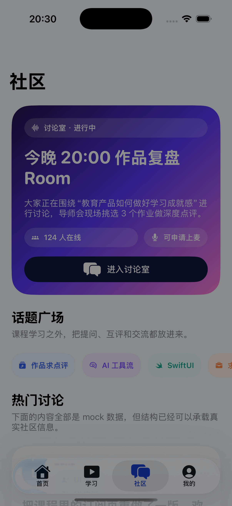
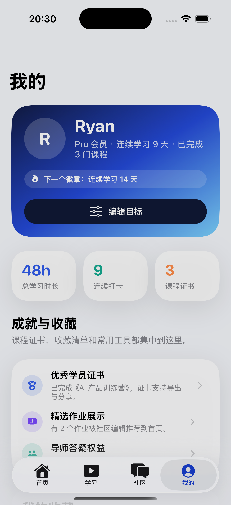

# iHubMobile

一个为在线教育场景设计的 iOS 应用原型，使用 Objective-C + UIKit 构建，强调 Apple 风格的视觉层次、沉浸式首页 Hero、课程学习路径和互动社区体验。

## Highlights

- 首页采用编辑推荐式内容编排，加入高冲击力 Hero section、次级推荐卡片与更清晰的内容动线
- 学习页整合进度概览、继续学习、周路径和离线学习空间
- 社区页包含讨论室、热门帖子、活动入口等互动模块
- 个人中心展示会员状态、学习成就、收藏与账号服务
- 全部内容均可用 Mock 数据快速演示，适合作为教育产品 UI 原型起点

## Screenshots

  
  

  
  

## Project Structure

- `iHubMobile/`: App source code
- `iHubMobile.xcodeproj/`: Xcode project
- `docs/screenshots/`: README screenshots

## Run

1. 用 Xcode 打开 `iHubMobile.xcodeproj`
2. 选择一个 iPhone 模拟器
3. 直接运行即可

## Notes

- 当前数据为本地 Mock 数据
- 截图通过启动参数切换不同 Tab 生成，便于后续继续维护 README 视觉素材
